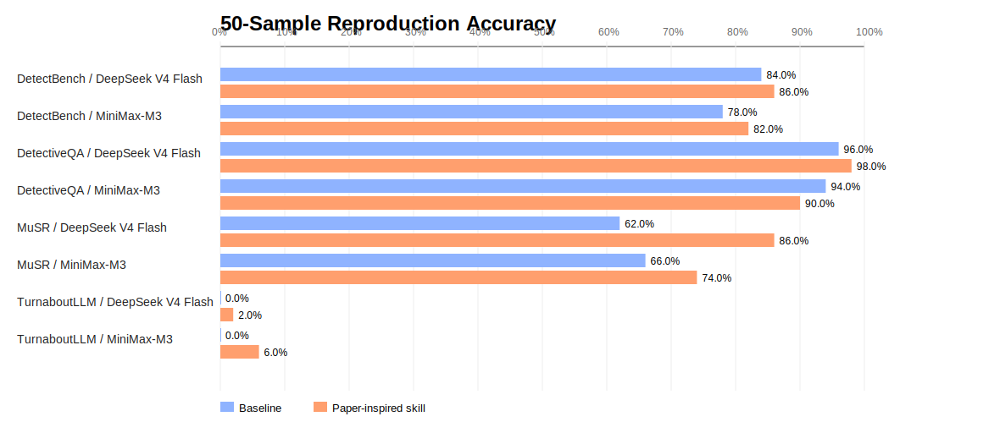

# 50-Sample Expanded Reproduction Report

Generated on 2026-07-04  
Experiment directory: `runs/reproduction_50_20260704_v2`  
Visualization: `notes/figures/reproduction_50_accuracy_by_dataset_model.svg`  

## 1. Scope

This run expands the previous 10-sample smoke test to 50 samples per condition. The matrix contains 4 datasets × 2 models × 2 methods, for 16 runs and 800 model calls.

- Datasets: MuSR murder mystery, DetectBench test-hard, DetectiveQA en_human, and TurnaboutLLM AA.
- Models: DeepSeek V4 Flash and MiniMax-M3.
- Conditions: direct baseline and a paper-inspired task skill.
- DetectiveQA: all novels required by the first 50 samples were downloaded locally. All 50/50 samples loaded novel context. The loader includes paragraphs up to `answer_position` and keeps the final 24,000 characters.
- Run status: all 16 runs completed.

## 2. Results

| Dataset | Model | Condition | Skill | Correct | Accuracy | Parse errors | Run ID |
|---|---|---|---|---:|---:|---:|---|
| MuSR | DeepSeek V4 Flash | Baseline | - | 31/50 | 62.0% | 0 | `run_20260704T010630Z_2cdb93dd` |
| MuSR | DeepSeek V4 Flash | Skill | `musr_cot_plus` | 43/50 | 86.0% | 0 | `run_20260704T010820Z_2434f237` |
| MuSR | MiniMax-M3 | Baseline | - | 33/50 | 66.0% | 0 | `run_20260704T011158Z_f0be3167` |
| MuSR | MiniMax-M3 | Skill | `musr_cot_plus` | 37/50 | 74.0% | 0 | `run_20260704T011500Z_11b8e7ce` |
| DetectBench | DeepSeek V4 Flash | Baseline | - | 42/50 | 84.0% | 0 | `run_20260704T012013Z_643d9009` |
| DetectBench | DeepSeek V4 Flash | Skill | `detectbench_detective_prompt` | 43/50 | 86.0% | 0 | `run_20260704T012211Z_6c74e394` |
| DetectBench | MiniMax-M3 | Baseline | - | 39/50 | 78.0% | 1 | `run_20260704T012451Z_154c042a` |
| DetectBench | MiniMax-M3 | Skill | `detectbench_detective_prompt` | 41/50 | 82.0% | 0 | `run_20260704T013321Z_f93d2d52` |
| DetectiveQA | DeepSeek V4 Flash | Baseline | - | 48/50 | 96.0% | 0 | `run_20260704T014146Z_1de6ab7e` |
| DetectiveQA | DeepSeek V4 Flash | Skill | `detectiveqa_stepwise_reasoning` | 49/50 | 98.0% | 0 | `run_20260704T014302Z_02f7b416` |
| DetectiveQA | MiniMax-M3 | Baseline | - | 47/50 | 94.0% | 0 | `run_20260704T014449Z_f98a2beb` |
| DetectiveQA | MiniMax-M3 | Skill | `detectiveqa_stepwise_reasoning` | 45/50 | 90.0% | 0 | `run_20260704T014713Z_fa71fcbb` |
| TurnaboutLLM | DeepSeek V4 Flash | Baseline | - | 0/50 | 0.0% | 1 | `run_20260704T015101Z_d219f2fc` |
| TurnaboutLLM | DeepSeek V4 Flash | Skill | `turnabout_contradiction_matrix` | 1/50 | 2.0% | 0 | `run_20260704T015246Z_20d566a9` |
| TurnaboutLLM | MiniMax-M3 | Baseline | - | 0/50 | 0.0% | 2 | `run_20260704T015435Z_2285c12a` |
| TurnaboutLLM | MiniMax-M3 | Skill | `turnabout_contradiction_matrix` | 3/50 | 6.0% | 1 | `run_20260704T015916Z_b93d6bb6` |

## 3. Skill Delta

| Dataset | Model | Baseline | Skill | Delta |
|---|---|---:|---:|---:|
| DetectBench | DeepSeek V4 Flash | 84.0% | 86.0% | +2.0 pp |
| DetectBench | MiniMax-M3 | 78.0% | 82.0% | +4.0 pp |
| DetectiveQA | DeepSeek V4 Flash | 96.0% | 98.0% | +2.0 pp |
| DetectiveQA | MiniMax-M3 | 94.0% | 90.0% | -4.0 pp |
| MuSR | DeepSeek V4 Flash | 62.0% | 86.0% | +24.0 pp |
| MuSR | MiniMax-M3 | 66.0% | 74.0% | +8.0 pp |
| TurnaboutLLM | DeepSeek V4 Flash | 0.0% | 2.0% | +2.0 pp |
| TurnaboutLLM | MiniMax-M3 | 0.0% | 6.0% | +6.0 pp |

## 4. What Each Skill Does

The `paper_skill` condition does not train or modify the model. It changes the test-time prompt by adding a task-specific reasoning procedure. In other words, each skill is a plug-in prompting strategy applied to the same sample and same model.

| Skill | Dataset | Method | Target ability | Current observation |
|---|---|---|---|---|
| `musr_cot_plus` | MuSR | Analyze each candidate by means, motive, opportunity, and story evidence; separate explicit facts from commonsense inferences; compare candidates before answering. | Multi-step soft reasoning, suspect comparison, evidence consistency | Strongest gain: DeepSeek +24 pp, MiniMax +8 pp. |
| `detectbench_detective_prompt` | DetectBench | Extract hidden clues, connect them as a multi-hop evidence chain, and use the chain to support or rule out each option. | Implicit evidence discovery, multi-hop reasoning, option elimination | Small positive gains, suggesting evidence-chain prompting helps but needs finer ablation. |
| `detectiveqa_stepwise_reasoning` | DetectiveQA | Build short ordered evidence steps from novel clues to inference, then map the final inference to an option. | Long-context evidence chains and step-wise explanation | DeepSeek improves slightly, while MiniMax drops; the extra structure may add noise in long-context settings. |
| `turnabout_contradiction_matrix` | TurnaboutLLM | Compare evidence-testimony pairs by temporal conflict, spatial conflict, causal conflict, physical impossibility, and direct factual mismatch. | Evidence-testimony contradiction detection | Still very low; prompt-only skill is insufficient without candidate-pair enumeration and a dedicated evaluator. |

Two additional general skills are available in the GUI but were not used as main 50-sample conditions:

- `external_evidence_bank`: attaches available structured evidence/reasoning annotations to the prompt, simulating an external evidence store.
- `structured_memory_stub`: asks the model to build a temporary timeline, location/entity memory, option evidence, and contradiction list before answering.

## 5. Initial Observations

MuSR remains a good first-stage benchmark because it is stable, affordable, and directly tests whether structured CoT improves multi-step mystery reasoning.

DetectBench should be interpreted per model. If the skill helps one model but hurts another, external structured prompting is not universally beneficial. The next step should split the large prompt into evidence card, timeline, contradiction check, and verifier ablations.

DetectiveQA is now a true novel-context test. However, fixed 24,000-character tail truncation is still a rough context strategy. The stronger research direction is to compare fixed truncation with retrieval-based external evidence selection.

TurnaboutLLM should not be used as a main benchmark until it has a candidate-pair interface. The task asks for exact evidence-testimony pairs, so enumerating candidate pairs should reduce numbering and order errors.

## 6. Next Steps

1. Run skill ablations on MuSR and DetectBench.
2. Add retrieval-based external evidence for DetectiveQA.
3. Add GUI charts for accuracy and token cost across models/methods.
4. Build a candidate-pair evaluator for TurnaboutLLM.
